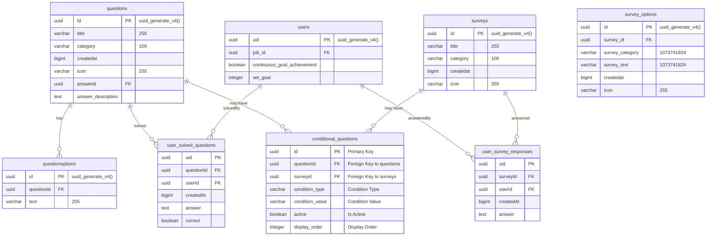

```mermaid
erDiagram
    questions ||--o{ questionoptions : "has"
    questions ||--o{ user_solved_questions : "solved"
    users ||--o{ user_solved_questions : "solvedBy"
    users ||--o{ user_survey_responses : "answeredBy"
    surveys ||--o{ user_survey_responses : "answered"
    questions ||--o{ conditional_questions : "may have"
    surveys ||--o{ conditional_questions : "may have"

    questions {
        uuid id PK "uuid_generate_v4()"
        varchar title "255"
        varchar category "100"
        bigint createdat
        varchar icon "255"
        uuid answerid FK
        text answer_description
    }

    questionoptions {
        uuid id PK "uuid_generate_v4()"
        uuid questionid FK
        varchar text "255"
    }

    surveys {
        uuid id PK "uuid_generate_v4()"
        varchar title "255"
        varchar category "100"
        bigint createdat
        varchar icon "255"
    }

    survey_options {
        uuid id PK "uuid_generate_v4()"
        uuid survey_id FK
        varchar survey_category "1073741824"
        varchar survey_text "1073741824"
        bigint createdat
        varchar icon "255"
    }

    conditional_questions {
        uuid id PK "Primary Key"
        uuid questionid FK "Foreign Key to questions"
        uuid surveyid FK "Foreign Key to surveys"
        varchar condition_type "Condition Type"
        varchar condition_value "Condition Value"
        boolean active "Is Active"
        integer display_order "Display Order"
    }

    users {
        uuid uid PK "uuid_generate_v4()"
        uuid job_id FK
        boolean continuous_goal_achievement
        integer set_goal
    }

    user_solved_questions {
        uuid uid PK
        uuid questionId FK
        uuid userId FK
        bigint createdAt
        text answer
        boolean correct
    }

    user_survey_responses {
        uuid uid PK
        uuid surveyId FK
        uuid userId FK
        bigint createdAt
        text answer
    }

```
